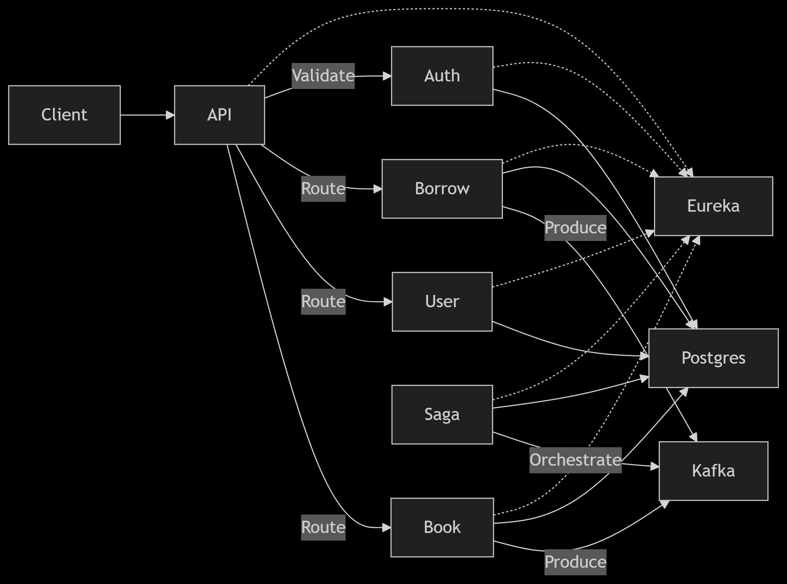

# Library Management System
This is a feature rich scalableLibrary Management System which enables librarians to manage books, users, borrows, and more. 

It is built with a microservice architecture, where each service is responsible for a specific aspect of the library management system. 
System is expected function well under 1000 concurrent users with millions of books.

## Service Decomposition
| Service             | Responsibility                                     | Tech Stack                 | Port | Database Schema | API Gateway Routing |
|----------------------|----------------------------------------------------|----------------------------|------|-----------------|---------------------|
| **Service Registry** | Service Discovery                                  | Netflix Eureka             | 8761 | -               | -                   |
| **Book Service** | Book CRUD, Search, Real-Time Updates              | WebFlux + Spring Data JPA | 8081 | books           | /books/** |
| **User Service** | User Management, Roles                             | Spring MVC + JPA           | 8082 | users           | /users/** |
| **Borrow Service** | Borrow/Return Logic, Overdue Tracking              | Spring MVC + JPA           | 8083 | borrows         | /borrows/** |
| **Auth Service** | JWT Generation/Validation                          | Spring Security            | 8084 | auth            | /auth/** |
| **Saga Service** | Distributed Transaction Orchestration              | Spring Boot + Kafka        | 8085 | saga            | /saga/** |
| **Notification Service** | Overdue Alerts (Optional)                        | Kafka + WebSocket          | 8086 | -               | /notifications/** |
| **API Gateway** | Routing, Security, Rate Limiting                   | Spring Cloud Gateway       | 8080 | -               | * |

## Architecture Diagram

 

```
.
├── discovery-service
│   ├── Dockerfile
│   └── src
├── api-gateway
│   ├── Dockerfile
│   └── src
├── book-service
│   ├── Dockerfile
│   └── src
├── user-service
│   ├── Dockerfile
│   └── src
├── borrow-service
│   ├── Dockerfile
│   └── src
├── auth-service
│   ├── Dockerfile
│   └── src
├── saga-service
│   ├── Dockerfile
│   └── src
├── notification-service
│   ├── Dockerfile
│   └── src
├── docker-compose.yml
├── start.sh
├── README.md
├── LowLevelDesign.png
└── init.sql
```

## Goals of this Architecture Pattern

* **Schema-based Isolation:** Each microservice utilizes its own dedicated schema within a PostgreSQL database, ensuring data isolation and autonomy.
* **Service Discovery:** Netflix Eureka enables dynamic service registration and discovery, allowing services to locate and communicate with each other.
* **Event-Driven Architecture:** Apache Kafka facilitates asynchronous communication between services through an event-driven architecture, improving resilience and decoupling.
* **Separate Dockerfiles:** Each microservice has its own Dockerfile, allowing for independent containerization and deployment.
* **Proper Service Dependencies:** Dependencies between services are explicitly defined and managed to ensure correct build and runtime order.
* **Auto Database Initialization:** Databases are automatically initialized with necessary schemas and potentially seed data upon container startup.
* **Volume Persistence for Databases:** Database data is persisted using Docker volumes, ensuring data is not lost when containers are stopped or restarted.
* **Network Isolation:** Docker networks are utilized to isolate the communication between services, enhancing security.

## Considerations

Running multiple independent containers for each microservice can be resource-intensive:

* **Higher RAM/CPU Consumption:** Each service runs in its own process (and potentially with its own JVM/runtime), leading to increased overall RAM and CPU usage compared to a monolithic application.

```bash
# Minimum requirements for smooth operation:
# - 4 CPU cores
# - 8GB RAM
# - 10GB Disk space
```

The distributed nature of microservices introduces additional development complexities:

* **Inter-service Communication:** Implementing communication between services (e.g., REST APIs, message queues) requires careful design and implementation.
* **Requires Implementing:**
    * **Circuit Breakers:** To prevent cascading failures when one service becomes unavailable.
    * **Retry Mechanisms:** To handle transient network issues or temporary service unavailability.
    * **Distributed Logging:** To effectively track requests and debug issues across multiple services.

While the system employs a schema-per-service strategy, it's important to note the following database tradeoffs:

* **Schema-per-service ≠ true database isolation:** Although each service has its own schema, they might still reside within the same underlying PostgreSQL instance.
* **Shared PostgreSQL instance remains a single point of failure:** If the shared PostgreSQL server fails, all services relying on it will be affected. For true isolation and high availability, consider deploying separate PostgreSQL instances for critical services.
